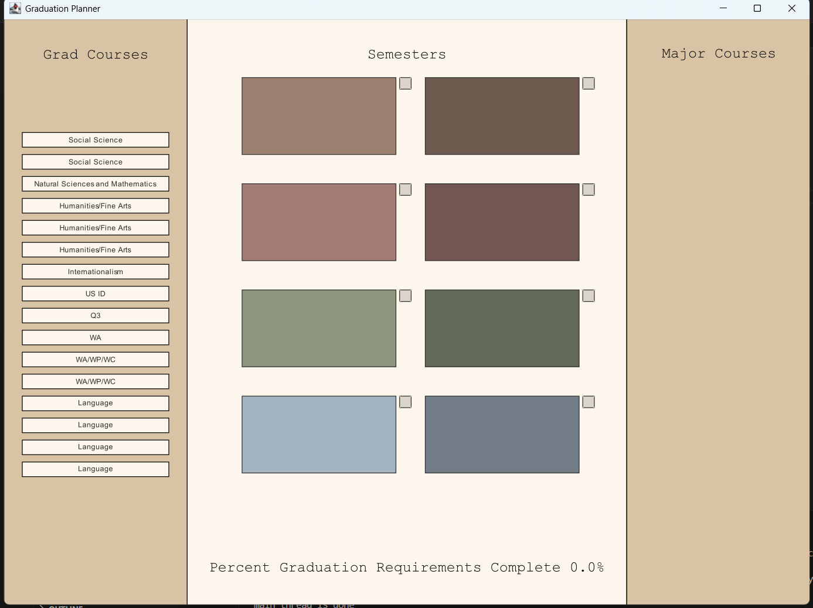

# Graduation Planner
## What is this GitHub repository all about?
This repo creates a planner for a student at Macalester to plan what semester they want to take required courses. It first prompts the user to enter the first 4 letters of their major name and then populates a planner with all the general and major graduation requirements. The user interface allows users to click and drag courses into semesters and tracks what percentage of requirements they've met.

## What software (with the version numbers) need to be installed to run the code contained in this GitHub repository, eg, openjdk 25.0.1 2025-10-21 LTS and VSCode 1.115.0
Java: openjdk 25.0.1 2025-10-21 LTS 
VSCode: 1.108.2 
Git: git version 2.51.0.windows.1
Github desktop: Version 3.5.4 (x64)

## What steps need to be taken to run the code contained in this GitHub repository? Think about the steps you did at the beginning of the semester to prepare your machine for class.
- Download all the recent versions and git 
- Set VSCode up to use Java and Github
  
## What does the expected output look like? You can use screenshots of the main windows of the software.

## Presentation video:
[Watch Video Here](https://drive.google.com/file/d/1Lv-JFipOGpGzFTCCnrRGxcW6P_tnIi-D/view?usp=sharing)

## Presentation slides:
[Slides](https://docs.google.com/presentation/d/1Imuj9KBNTF5zVduivKXQXu8mAVqyeOuGfjwsOiVStSg/edit?usp=sharing)

## What known limitations does the software currently suffer from, eg, known bugs or cases that the software can not currently handle?
No bugs that we are aware of, but you cannot do more than one major or a minor. You also cannot add more than 4 courses to a semester, which might be an issue for courses that count for multiple requirements.

## What resources were referenced while developing the software?
COMP 127 class materials, kilt graphics API, Java codebook, stack overflow
